#  Diagram

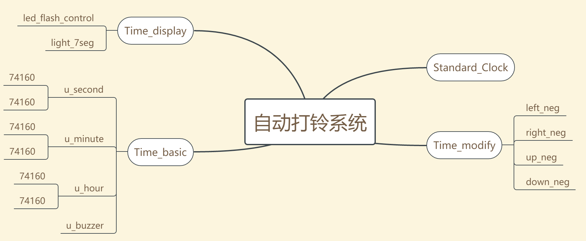

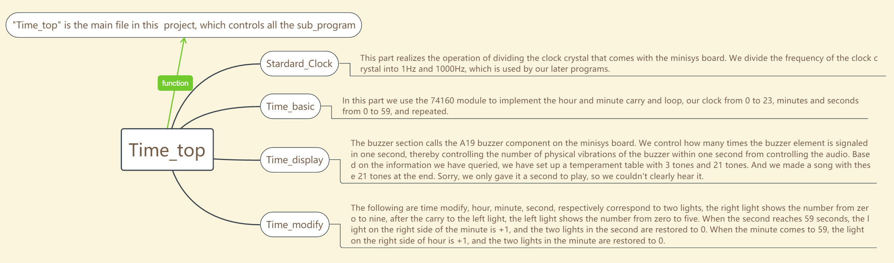

# DESIGN

* * *

>  `Time_top.v`
>
> is the main design file.

```verilog
module Time_top(
    input clk_system_0,//Y18 系统时钟
    input rst_n,
    input LD_n,//time loader
    input left, right, up, down,
    input audio_seg,
    output clk_system,
    output wire[7:0] seg_en_1kHz,
    output wire clk_1Hz, clk_1kHz,
    output wire clk_1Hz_display,
    output wire [6:0]seg_out,
    output wire [7:0]modify_seg,
    output audio,
    output wire audio_led
    );
    assign audio_led = audio_seg;

    Standard_Clock Standard_Clock( clk_system_0,rst_n,clk_system,clk_1Hz,clk_1kHz);
    wire Sec_D6, Sec_D5, Sec_D4, Sec_D3, Sec_D2, Sec_D1, Sec_D0;
    wire Min_D6, Min_D5, Min_D4, Min_D3, Min_D2, Min_D1, Min_D0;
    wire Hour_D6,Hour_D5, Hour_D4, Hour_D3, Hour_D2, Hour_D1, Hour_D0;
    wire Sec_Q6, Sec_Q5, Sec_Q4, Sec_Q3, Sec_Q2, Sec_Q1, Sec_Q0;
    wire Min_Q6, Min_Q5, Min_Q4, Min_Q3, Min_Q2, Min_Q1, Min_Q0;
    wire Hour_Q6, Hour_Q5, Hour_Q4, Hour_Q3, Hour_Q2, Hour_Q1, Hour_Q0;

    Time_modify Time_modify( clk_1Hz, clk_1kHz,LD_n,rst_n,left, right, up, down,
                             Sec_Q6, Sec_Q5, Sec_Q4, Sec_Q3, Sec_Q2, Sec_Q1, Sec_Q0,
                             Min_Q6, Min_Q5, Min_Q4, Min_Q3, Min_Q2, Min_Q1, Min_Q0,
                             Hour_Q6, Hour_Q5, Hour_Q4, Hour_Q3, Hour_Q2, Hour_Q1, Hour_Q0,
                             Sec_D6, Sec_D5, Sec_D4, Sec_D3, Sec_D2, Sec_D1, Sec_D0,
                             Min_D6, Min_D5, Min_D4, Min_D3, Min_D2, Min_D1, Min_D0,
                             Hour_D6,Hour_D5, Hour_D4, Hour_D3, Hour_D2, Hour_D1, Hour_D0,
                             modify_seg);

    Time_Basic Time_Basic(  clk_system_0, clk_1Hz,clk_1kHz, 1, 1,rst_n, LD_n,
                            Sec_D6, Sec_D5, Sec_D4, Sec_D3, Sec_D2, Sec_D1, Sec_D0,
                            Min_D6, Min_D5, Min_D4, Min_D3, Min_D2, Min_D1, Min_D0,
                            Hour_D6,Hour_D5, Hour_D4, Hour_D3, Hour_D2, Hour_D1, Hour_D0, audio_seg,
                            Sec_Q6, Sec_Q5, Sec_Q4, Sec_Q3, Sec_Q2, Sec_Q1, Sec_Q0,
                            Min_Q6, Min_Q5, Min_Q4, Min_Q3, Min_Q2, Min_Q1, Min_Q0,
                            Hour_Q6, Hour_Q5, Hour_Q4, Hour_Q3, Hour_Q2, Hour_Q1, Hour_Q0
                            , audio, audio_led );

    time_display time_display(clk_1Hz, clk_1kHz, rst_n, seg_en_1kHz,LD_n,modify_seg,
                                Sec_Q6, Sec_Q5, Sec_Q4, Sec_Q3, Sec_Q2, Sec_Q1, Sec_Q0,
                                Min_Q6, Min_Q5, Min_Q4, Min_Q3, Min_Q2, Min_Q1, Min_Q0,
                                Hour_Q6, Hour_Q5, Hour_Q4, Hour_Q3, Hour_Q2, Hour_Q1, Hour_Q0,
                                seg_out, clk_1Hz_display);


endmodule
```

> #### `Standard_Clock.v`

```verilog
module Standard_Clock(
    input wire clk_system_0,
    input wire rst_n,
    output clk_system,
    output reg clk_1Hz,
    output reg clk_1kHz
);
    reg[26:0] counter_1Hz;
    reg [26:0] counter_Max_1Hz;
    reg[26:0] counter_1kHz;
    reg [26:0] counter_Max_1kHz;
    assign clk_system = clk_system_0;
    initial
    begin
        counter_Max_1kHz = 26'd50000;//50000;
        counter_1kHz = counter_Max_1Hz-1;
        clk_1kHz = 1'b0;
        counter_Max_1Hz = 26'd50000000;//50000000;
        counter_1Hz = counter_Max_1Hz-1;
        clk_1Hz = 1'b0;
    end
    always@(posedge clk_system_0 or negedge rst_n)
    begin
        if(rst_n == 0)            
        begin
            counter_1Hz <= 0;
            clk_1Hz <= 0;
        end
        else if(counter_1Hz == counter_Max_1Hz - 1)
        begin
            counter_1Hz <= 0 ;
            clk_1Hz <= ~clk_1Hz;
        end
        else                
            counter_1Hz <= counter_1Hz + 1;
    end

    always@(posedge clk_system_0 or negedge rst_n)
    begin
        if(rst_n == 0)            
        begin
            counter_1kHz <= 0;
            clk_1kHz <= 0;
        end
        else if(counter_1kHz == counter_Max_1kHz - 1)
        begin
            counter_1kHz <= 0 ;
            clk_1kHz <= ~clk_1kHz;
        end
        else                
            counter_1kHz <= counter_1kHz + 1;
    end
endmodule
```

> #### `Time_Basic.v`
>
> includes `u_hour:module24_74160_P.v`, `u_minute:module60_74160_P.v`, `u_minute:second60_74160_P.v`

```verilog
module Time_Basic(
    input clk_system_0, sys_clk_1Hz,clk_1kHz,
    input ET, EP,
    input CR_n, //reset
    input LD_n, //load
    input Sec_D6, Sec_D5, Sec_D4, Sec_D3, Sec_D2, Sec_D1, Sec_D0,
    input Min_D6, Min_D5, Min_D4, Min_D3, Min_D2, Min_D1, Min_D0,
    input Hour_D6,Hour_D5, Hour_D4, Hour_D3, Hour_D2, Hour_D1, Hour_D0,
    input audio_seg,
    output wire Sec_Q6, Sec_Q5, Sec_Q4, Sec_Q3, Sec_Q2, Sec_Q1, Sec_Q0,
    output wire Min_Q6, Min_Q5, Min_Q4, Min_Q3, Min_Q2, Min_Q1, Min_Q0,
    output wire Hour_Q6, Hour_Q5, Hour_Q4, Hour_Q3, Hour_Q2, Hour_Q1, Hour_Q0,
    output wire audio, audio_led
    );
    wire rco_minute, rco_hour, rco_day;
    module60_74160_P u_second(sys_clk_1Hz, ET,         EP,         CR_n, LD_n, Sec_D6, Sec_D5, Sec_D4, Sec_D3, Sec_D2, Sec_D1, Sec_D0, Sec_Q6, Sec_Q5, Sec_Q4, Sec_Q3, Sec_Q2, Sec_Q1, Sec_Q0, rco_minute);
    module60_74160_P u_minute(sys_clk_1Hz, rco_minute, rco_minute, CR_n, LD_n, Min_D6, Min_D5, Min_D4, Min_D3, Min_D2, Min_D1, Min_D0, Min_Q6, Min_Q5, Min_Q4, Min_Q3, Min_Q2, Min_Q1, Min_Q0, rco_hour);
    module24_74160_P u_hour__(sys_clk_1Hz, (rco_hour&rco_minute),   (rco_hour&rco_minute),   CR_n, LD_n, Hour_D6,Hour_D5, Hour_D4, Hour_D3, Hour_D2, Hour_D1, Hour_D0, Hour_Q6, Hour_Q5, Hour_Q4, Hour_Q3, Hour_Q2, Hour_Q1, Hour_Q0, rco_day);
    buzzer u_buzzer(clk_system_0,sys_clk_1Hz,clk_1kHz,(rco_hour&rco_minute) , audio_seg, audio);//(rco_hour&rco_minute)为小时的跳转信号
endmodule
```

> ##### `u_second:module60_74160_P.v`
>
> with `u1` and `u2`

```verilog
module module60_74160_P(
    input clk,
    input ET, EP,
    input CR_n, //reset
    input LD_n, //load
    input D6, D5, D4, D3, D2, D1, D0,
    output Q6, Q5, Q4, Q3, Q2, Q1, Q0,
    output rco
    );
    assign rco = Q6&~Q5&Q4&Q3&~Q2&~Q1&Q0;
    wire Q7;
    Counter74160 u1(clk, ET, ET, CR_n, LD_n, D3, D2, D1, D0, Q3, Q2, Q1, Q0, rco_0);
    Counter74160 u2(clk, rco_0, rco_0, ~(Q6&Q5), LD_n, 0, D6, D5, D4, Q7, Q6, Q5, Q4);
endmodule
```

> ###### `60_74160_P.v`

```verilog
module Counter74160(
    input clk,  //clock
    input ET, EP,
    input CR_n, //reset
    input LD_n, //load
    input D3, D2, D1, D0,
    output reg Q3, Q2, Q1, Q0,
    output rco
    );
    assign rco = ET&Q3&Q0;
    always@(posedge clk or negedge CR_n)
    begin
        if(~CR_n)
            {Q3, Q2, Q1, Q0} = 4'b0000;
        else if(~LD_n)
            {Q3, Q2, Q1, Q0} <= {D3, D2, D1, D0};
        else if(ET & EP == 1'b1)
        begin
            if({Q3, Q2, Q1, Q0} != 4'b1001) //遇到9则下一个状态归0
                {Q3, Q2, Q1, Q0} <= {Q3, Q2, Q1, Q0} + 1;
            else
                {Q3, Q2, Q1, Q0} <= 4'b0000;
        end
    end
endmodule
```

> ##### `u_minute:module60_74160_P.v`
>
>  with `u1` and `u2`

```verilog
module module60_74160_P(
    input clk,
    input ET, EP,
    input CR_n, //reset
    input LD_n, //load
    input D6, D5, D4, D3, D2, D1, D0,
    output Q6, Q5, Q4, Q3, Q2, Q1, Q0,
    output rco
    );
    assign rco = Q6&~Q5&Q4&Q3&~Q2&~Q1&Q0;
    wire Q7;
    Counter74160 u1(clk, ET, ET, CR_n, LD_n, D3, D2, D1, D0, Q3, Q2, Q1, Q0, rco_0);
    Counter74160 u2(clk, rco_0, rco_0, ~(Q6&Q5), LD_n, 0, D6, D5, D4, Q7, Q6, Q5, Q4);
endmodule
```

> ##### `u_hour:module24_74160_P.v`
>
> with `u1` and `u2`

```verilog
module module24_74160_P(
    input clk,
input ET, EP,
input CR_n, //reset
input LD_n, //load
input D6, D5, D4, D3, D2, D1, D0,
output Q6, Q5, Q4, Q3, Q2, Q1, Q0,
output rco
);
//    assign rco = Q6&Q5&Q4&Q3&Q2&Q1&Q0;
assign rco = Q6&~Q5&Q4&Q3&~Q2&~Q1&Q0;
wire Q7;
Counter74160 u1(clk, ET, ET, ~(Q5&Q2), LD_n, D3, D2, D1, D0, Q3, Q2, Q1, Q0, rco_0);
Counter74160 u2(clk, rco_0, rco_0, ~(Q5&Q2), LD_n, 0, D6, D5, D4, Q7, Q6, Q5, Q4);
endmodule
```

> #### `u_buzzer.v`
>
> make the clock music

```verilog
module buzzer(
    input clk_100MHz,clk_1Hz,clk_1kHz,
    input button,
    input audio_seg,
    output audio,
    output audio_led
    );
    reg  [23:0] counterHz,counterMHz;
    reg  [13:0]  count,origin;
    reg  audiof;

    reg  clk_MHz,
      clk_Hz;

    reg  [4:0]  yinlu;
    reg  [7:0]  len;

                   /* 总声音开关 */
 assign audio= (button&&audio_seg)? audiof : 1'b1 ;  //控制开关

 always @(posedge clk_100MHz)              //5MHz分频
 begin
     if(counterMHz==200)
     begin
         counterMHz=0;
         clk_MHz=~clk_MHz;
     end
     else
     begin
         counterMHz=counterMHz+1;
     end
 end

 always @(posedge clk_100MHz)                 //5Hz分频
 begin
     if(counterHz==1967)              
     begin
         counterHz=0;
         clk_Hz=~clk_Hz;
     end
     else
     begin
         counterHz=counterHz+1;
     end
 end

 always @(posedge clk_MHz)
 begin
     if(count==1967)    
     begin
         count=origin;
         audiof=~audiof;
     end
     else
         count=count+1;
 end

 always @(posedge clk_Hz)       
 begin
      case(yinlu)
     'd1:origin='d262;  //low
     'd2:origin='d294;
     'd3:origin='d330;
     'd4:origin='d349;
     'd5:origin='d392;
     'd6:origin='d440;
     'd7:origin='d494;
     'd8:origin='d523;  //middle
     'd9:origin='d587;
     'd10:origin='d659;
     'd11:origin='d698;
     'd12:origin='d784;
     'd13:origin='d880;
     'd14:origin='d988;
     'd15:origin='d1046;  //high
     'd16:origin='d1175;
     'd17:origin='d1318;
     'd18:origin='d1397;
     'd19:origin='d1568;
     'd20:origin='d1760;
     'd21:origin='d1967;
     default:origin='d1024; // default
     endcase             
 end

 always @(posedge clk_Hz)  //music
 begin
      if(len==21)
         len=0;
     else
         len=len+1;
     case(len)
      1:yinlu=1;
      2:yinlu=2;
      3:yinlu=3;
      4:yinlu=4;
      5:yinlu=5;
      6:yinlu=6;
      7:yinlu=7;
      8:yinlu=8;
      9:yinlu=9;
      10:yinlu=10;
      11:yinlu=11;
      12:yinlu=12;
      13:yinlu=13;
      14:yinlu=14;
      15:yinlu=15;
      16:yinlu=16;
      17:yinlu=17;
      18:yinlu=18;
      19:yinlu=19;
      20:yinlu=20;
      21:yinlu=21;
      default:yinlu=0;
 endcase
 end
endmodule
```

> #### `time_display.v`

```verilog
module time_display(
    input clk_1Hz, clk_1kHz,
    input rst_n,
    input wire[7:0]seg_en,
    input LD_n,
    input [7:0]modify_seg,
    input Sec_Q6, Sec_Q5, Sec_Q4, Sec_Q3, Sec_Q2, Sec_Q1, Sec_Q0,
    input Min_Q6, Min_Q5, Min_Q4, Min_Q3, Min_Q2, Min_Q1, Min_Q0,
    input Hour_Q6, Hour_Q5, Hour_Q4, Hour_Q3, Hour_Q2, Hour_Q1, Hour_Q0,
    output [6:0]seg_out,
    output reg clk_1Hz_display
    );
    reg [6:0]seg_en_1kHz_display;
    led_flash_control led_flash_control(clk_1kHz,rst_n,0,seg_en);
    reg [3:0]cin;
//    reg clk_1Hz_display;
    wire [6:0]seg_out;
    always@*/* 解决了刷新错位的问题 */
    begin
        if(LD_n == 0)
            seg_en_1kHz_display = seg_en & ( ~modify_seg | ~{clk_1Hz,clk_1Hz,clk_1Hz,clk_1Hz,clk_1Hz,clk_1Hz,clk_1Hz,clk_1Hz});
        else
            seg_en_1kHz_display = seg_en;
        if(!rst_n)
            cin = 4'd10;//default
        else
        begin
            case(seg_en)
                8'b0111_1111: cin = {0,Hour_Q6, Hour_Q5, Hour_Q4};
                8'b1011_1111: cin = {Hour_Q3, Hour_Q2, Hour_Q1, Hour_Q0};
                8'b1101_1111: cin = {0,Min_Q6, Min_Q5, Min_Q4};
                8'b1110_1111: cin = {Min_Q3, Min_Q2, Min_Q1, Min_Q0};
                8'b1111_0111: cin = {0,Sec_Q6, Sec_Q5, Sec_Q4};
                8'b1111_1011: cin = {Sec_Q3, Sec_Q2, Sec_Q1, Sec_Q0};
                8'b1111_1101: cin = 4'd10;
                8'b1111_1110: cin = 4'd10;
                default: cin = 4'd1;
            endcase
        end
        if(seg_en == 8'b1011_1111)
            clk_1Hz_display = ~clk_1Hz;
        else
            clk_1Hz_display = 1'b1;
    end
        /* 控制修改时的闪烁 */

//    always@*

    light_7seg light_7seg(cin, seg_out);
endmodule
```

> ##### `led_flash_control.v`

```verilog
module led_flash_control(
    input clk_1kHz,
    input rst_n,
    input dir,
    output reg[7:0]seg_en
    );
    reg[7:0]seg_en_1;
    always@(posedge clk_1kHz)
        if(!rst_n)
            seg_en = 8'b1111_1110;
        else
            seg_en = ~seg_en_1;
    always @(posedge clk_1kHz or negedge rst_n)
    begin
        if(!rst_n)
            seg_en_1 = 8'b0000_0001;
        else
        begin
            case(dir)
                1'b0:
                if(clk_1kHz)
                    if(seg_en_1 != 8'b0000_0001)
                        seg_en_1 = seg_en_1>>1'b1;
                    else
                        seg_en_1 = 8'b1000_0000;
                1'b1://从右向左
                if(clk_1kHz)
                    if(seg_en_1 != 8'b1000_0000)
                        seg_en_1 = seg_en_1<<1'b1;
                    else
                        seg_en_1 = 8'd1;
            endcase
        end

    end
endmodule
```

> ##### `light_7seg.v`

```verilog
module light_7seg(
    input [3:0] cin,
    output [6:0] seg_out
);
    reg [6:0]seg_out;
    always @*
    begin
        case(cin)
            4'd0: seg_out = 7'b100_0000;
            4'd1: seg_out = 7'b111_1001;
            4'd2: seg_out = 7'b010_0100;
            4'd3: seg_out = 7'b011_0000;
            4'd4: seg_out = 7'b001_1001;
            4'd5: seg_out = 7'b001_0010;
            4'd6: seg_out = 7'b000_0010;
            4'd7: seg_out = 7'b111_1000;
            4'd8: seg_out = 7'b000_0000;
            4'd9: seg_out = 7'b001_0000;
            default: seg_out = 7'b111_0111;
        endcase
    end
endmodule
```

> #### `Time_modify.v`

```verilog
module Time_modify(
    input clk_1Hz, clk_1kHz,
    input LD_n,rst_n,
    input left, right, up, down,
    input wire Sec_Q6, Sec_Q5, Sec_Q4, Sec_Q3, Sec_Q2, Sec_Q1, Sec_Q0,
    input wire Min_Q6, Min_Q5, Min_Q4, Min_Q3, Min_Q2, Min_Q1, Min_Q0,
    input wire Hour_Q6, Hour_Q5, Hour_Q4, Hour_Q3, Hour_Q2, Hour_Q1, Hour_Q0,
    output reg Sec_D6, Sec_D5, Sec_D4, Sec_D3, Sec_D2, Sec_D1, Sec_D0,
    output reg Min_D6, Min_D5, Min_D4, Min_D3, Min_D2, Min_D1, Min_D0,
    output reg Hour_D6,Hour_D5, Hour_D4, Hour_D3, Hour_D2, Hour_D1, Hour_D0,
    output reg [7:0]modify_seg
    );
    wire left_neg_signal, right_neg_signal, up_neg_signal, down_neg_signal;
    neg_signal left_neg(clk_1kHz, left, left_neg_signal);
    neg_signal right_neg(clk_1kHz, right, right_neg_signal);
    neg_signal up_neg(clk_1kHz, up, up_neg_signal);
    neg_signal down_neg(clk_1kHz, down, down_neg_signal);
    /* modify_seg初始化 */
    always@(posedge clk_1kHz)
    begin
        if(rst_n == 0)
            modify_seg = 8'b0000_0001;
        else
        begin
            if(left_neg_signal == 1)
                if(modify_seg == 8'b1000_0000)
                    modify_seg = 8'b0000_0001;
                else
                    modify_seg = modify_seg<<1'b1;
            if(right_neg_signal == 1)
                 if(modify_seg == 8'b0000_0001)
                    modify_seg = 8'b1000_0000;
                else
                    modify_seg = modify_seg>>1'b1;
        end
    end

    always@(posedge clk_1kHz)
        if(rst_n == 0)
        begin
         {Sec_D6, Sec_D5, Sec_D4, Sec_D3, Sec_D2, Sec_D1, Sec_D0} <= 7'b000_0000;
         {Min_D6, Min_D5, Min_D4, Min_D3, Min_D2, Min_D1, Min_D0} <= 7'b000_0000;
         {Hour_D6,Hour_D5, Hour_D4, Hour_D3, Hour_D2, Hour_D1, Hour_D0} <= 7'b000_0000;
        end
        else
        if(LD_n==1)
        begin
             {Sec_D6, Sec_D5, Sec_D4, Sec_D3, Sec_D2, Sec_D1, Sec_D0} <= {Sec_Q6, Sec_Q5, Sec_Q4, Sec_Q3, Sec_Q2, Sec_Q1, Sec_Q0};
             {Min_D6, Min_D5, Min_D4, Min_D3, Min_D2, Min_D1, Min_D0} <= {Min_Q6, Min_Q5, Min_Q4, Min_Q3, Min_Q2, Min_Q1, Min_Q0};
             {Hour_D6,Hour_D5, Hour_D4, Hour_D3, Hour_D2, Hour_D1, Hour_D0} <= {Hour_Q6, Hour_Q5, Hour_Q4, Hour_Q3, Hour_Q2, Hour_Q1, Hour_Q0};
        end
        else
        begin
            case(modify_seg)
                8'b0000_0001:;
                8'b0000_0010:;
                8'b0000_0100://秒针个位
                    begin
                    if(up_neg_signal==1)
                        if({Sec_D3, Sec_D2, Sec_D1, Sec_D0}< 4'd9)
                            {Sec_D3, Sec_D2, Sec_D1, Sec_D0} <= {Sec_D3, Sec_D2, Sec_D1, Sec_D0} + 1;
                        else
                            {Sec_D3, Sec_D2, Sec_D1, Sec_D0} <= 4'd0;
                    if(down_neg_signal==1)
                        if({Sec_D3, Sec_D2, Sec_D1, Sec_D0}> 4'd0)
                            {Sec_D3, Sec_D2, Sec_D1, Sec_D0} <= {Sec_D3, Sec_D2, Sec_D1, Sec_D0} - 1;
                        else
                            {Sec_D3, Sec_D2, Sec_D1, Sec_D0} <= 4'd9;
                    end
                8'b0000_1000://秒针十位
                    begin
                if(up_neg_signal==1)
                    if({Sec_D6, Sec_D5, Sec_D4}< 3'd5)
                        {Sec_D6, Sec_D5, Sec_D4} <= {Sec_D6, Sec_D5, Sec_D4} + 1;
                    else
                        {Sec_D6, Sec_D5, Sec_D4} <= 3'd0;
                if(down_neg_signal==1)
                    if({Sec_D6, Sec_D5, Sec_D4}> 3'd0)
                        {Sec_D6, Sec_D5, Sec_D4} <= {Sec_D6, Sec_D5, Sec_D4} - 1;
                    else
                        {Sec_D6, Sec_D5, Sec_D4} <= 3'd5;
                end
                8'b0001_0000://分针个位
                    begin
                if(up_neg_signal==1)
                    if({Min_D3, Min_D2, Min_D1, Min_D0}< 4'd9)
                        {Min_D3, Min_D2, Min_D1, Min_D0} <= {Min_D3, Min_D2, Min_D1, Min_D0} + 1;
                    else
                        {Min_D3, Min_D2, Min_D1, Min_D0} <= 4'd0;
                if(down_neg_signal==1)
                    if({Min_D3, Min_D2, Min_D1, Min_D0}> 4'd0)
                        {Min_D3, Min_D2, Min_D1, Min_D0} <= {Min_D3, Min_D2, Min_D1, Min_D0} - 1;
                    else
                        {Min_D3, Min_D2, Min_D1, Min_D0} <= 4'd9;
                end
                8'b0010_0000://分针十位
                    begin
                if(up_neg_signal==1)
                    if({Min_D6, Min_D5, Min_D4}< 3'd5)
                        {Min_D6, Min_D5, Min_D4} <= {Min_D6, Min_D5, Min_D4} + 1;
                    else
                        {Min_D6, Min_D5, Min_D4} <= 3'd0;
                if(down_neg_signal==1)
                    if({Min_D6, Min_D5, Min_D4}> 3'd0)
                        {Min_D6, Min_D5, Min_D4} <= {Min_D6, Min_D5, Min_D4} - 1;
                    else
                        {Min_D6, Min_D5, Min_D4} <= 3'd5;
                end
                8'b0100_0000://时针个位
                    begin
                if(up_neg_signal==1)
                if({Hour_D6,Hour_D5, Hour_D4} == 4'd2)
                    if({Hour_D3, Hour_D2, Hour_D1, Hour_D0}< 4'd3)
                        {Hour_D3, Hour_D2, Hour_D1, Hour_D0} <= {Hour_D3, Hour_D2, Hour_D1, Hour_D0} + 1;
                    else
                        {Hour_D3, Hour_D2, Hour_D1, Hour_D0} <= 4'd0;
                else
                    if({Hour_D3, Hour_D2, Hour_D1, Hour_D0}< 4'd9)
                        {Hour_D3, Hour_D2, Hour_D1, Hour_D0} <= {Hour_D3, Hour_D2, Hour_D1, Hour_D0} + 1;
                    else
                        {Hour_D3, Hour_D2, Hour_D1, Hour_D0} <= 4'd0;
                if(down_neg_signal==1)
                if({Hour_D6,Hour_D5, Hour_D4} == 4'd2)
                    if({Hour_D3, Hour_D2, Hour_D1, Hour_D0}> 4'd0)
                        {Hour_D3, Hour_D2, Hour_D1, Hour_D0} <= {Hour_D3, Hour_D2, Hour_D1, Hour_D0} - 1;
                    else
                        {Hour_D3, Hour_D2, Hour_D1, Hour_D0} <= 4'd3;
                else
                    if({Hour_D3, Hour_D2, Hour_D1, Hour_D0}> 4'd0)
                        {Hour_D3, Hour_D2, Hour_D1, Hour_D0} <= {Hour_D3, Hour_D2, Hour_D1, Hour_D0} - 1;
                    else
                        {Hour_D3, Hour_D2, Hour_D1, Hour_D0} <= 4'd9;
                end
                8'b1000_0000://时针十位
                    begin
                if(up_neg_signal==1)
                if({Hour_D3, Hour_D2, Hour_D1, Hour_D0} < 3)
                    if({Hour_D6,Hour_D5, Hour_D4}< 3'd2)
                        {Hour_D6,Hour_D5, Hour_D4} <= {Hour_D6,Hour_D5, Hour_D4} + 1;
                    else
                        {Hour_D6,Hour_D5, Hour_D4} <= 3'd0;

                if(down_neg_signal==1)
                    if({Hour_D6,Hour_D5, Hour_D4}> 3'd0)
                        {Hour_D6,Hour_D5, Hour_D4} <= {Hour_D6,Hour_D5, Hour_D4} - 1;
                    else
                        {Hour_D6,Hour_D5, Hour_D4} <= 3'd2;
                end
            endcase


        end
endmodule
```

> ##### `neg_signal.v`

```verilog
module neg_signal(
    input clk_1kHz,
    input ori_signal,
    output neg_signal
//    output[2:0] delay
);
    reg[2:0] delay;
    wire neg_signal;
    assign neg_signal = ( ~delay[1] ) && delay[2];      // 原信号下降沿位置处产生的pulse信号
    always @ ( posedge clk_1kHz)
         delay <= { delay[1:0], ori_signal} ;// ori_signal是原信号
//    wire pos_signal = delay[1] && ( ~delay[2] );       // 原信号上升沿位置处产生的pulse信号
endmodule
```

* * *

# SIMULATION

* * *

## Standard_Clock

>  为了方便进行仿真，修改了对应的时钟周期，使其相对于仿真的系统时钟，周期分别为2倍和4倍。

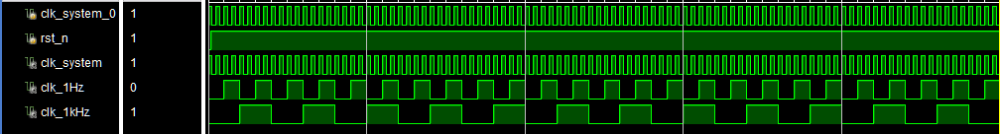

```verilog
module sim_Standard_Clock( );
    reg clk_system_0, rst_n;
    wire clk_system, clk_1Hz, clk_1kHz;
    Standard_Clock u( clk_system_0,rst_n,clk_system,clk_1Hz,clk_1kHz);
    initial
    begin
        rst_n = 1'b0;
        clk_system_0 = 1'b1;
        fork
            forever #5 clk_system_0 = ~clk_system_0;
            #3  rst_n = ~rst_n;
        join
    end
endmodule
```

## Time_Modify

> 此处主要通过侦测按钮的下降沿信号，实现两个功能：
>
> 1. 移动所需修改的数码管
>
> 2. 增加或减少
>
> 由于代码重复性较高且相对简单，不再仿真，将在操作描述处展示，此处只仿真一个按钮的下降沿信号侦测。

```verilog
    reg[2:0] delay;
    wire neg_signal;
    assign neg_signal = ( ~delay[1] ) && delay[2];
    always @ ( posedge clk_1kHz)
        //为了消除边沿的“毛刺”现象，使用了连续的D触发器进行了延迟处理，可在波形图最初观察到
        delay <= { delay[1:0], ori_signal} ;
```

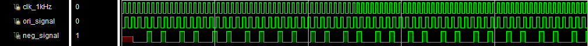

```verilog
module sim_neg_signal( );
    reg clk_1kHz,ori_signal;
    wire neg_signal;
    neg_signal u(clk_1kHz,ori_signal, neg_signal);
    initial
    begin
    clk_1kHz = 1'b0;
    ori_signal = 1'b0;
    fork
        forever #5 clk_1kHz = ~clk_1kHz;
        forever #7 ori_signal = ~ori_signal;
    join
    end
endmodule
```

## Time_Basic

> 基础的时钟，使用`Counter74160`进行实现
>
> 由于`Counter74160`的功能标准化，此处不进行单独的仿真，
>
> 仅仿真基于其设计的`module24_74160_P` 和`module60_74160_P`

### Time_Basic

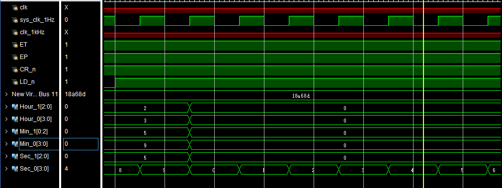

```verilog
module sim_Time_Basic( );
    reg  clk, ET, EP, CR_n, LD_n;
    reg Sec_D6, Sec_D5, Sec_D4, Sec_D3, Sec_D2, Sec_D1, Sec_D0;
    reg Min_D6, Min_D5, Min_D4, Min_D3, Min_D2, Min_D1, Min_D0;
    reg Hour_D6, Hour_D5, Hour_D4, Hour_D3, Hour_D2, Hour_D1, Hour_D0;
    wire Sec_Q6, Sec_Q5, Sec_Q4, Sec_Q3, Sec_Q2, Sec_Q1, Sec_Q0;
    wire Min_Q6, Min_Q5, Min_Q4, Min_Q3, Min_Q2, Min_Q1, Min_Q0;
    wire Hour_Q6, Hour_Q5, Hour_Q4, Hour_Q3, Hour_Q2, Hour_Q1, Hour_Q0;
    Time_Basic u(clk, ET, EP, CR_n, LD_n,
                 Sec_D6, Sec_D5, Sec_D4, Sec_D3, Sec_D2, Sec_D1, Sec_D0,
                 Min_D6, Min_D5, Min_D4, Min_D3, Min_D2, Min_D1, Min_D0,
                 Hour_D6, Hour_D5, Hour_D4, Hour_D3, Hour_D2, Hour_D1, Hour_D0,
                 Sec_Q6, Sec_Q5, Sec_Q4, Sec_Q3, Sec_Q2, Sec_Q1, Sec_Q0,
                 Min_Q6, Min_Q5, Min_Q4, Min_Q3, Min_Q2, Min_Q1, Min_Q0,
                 Hour_Q6, Hour_Q5, Hour_Q4, Hour_Q3, Hour_Q2, Hour_Q1, Hour_Q0);
    initial
    begin
        ET = 1'b1;
        EP = 1'b1;
        CR_n = 1'b1;
        clk = 1'b0;
        LD_n = 1'b0;
        /* 秒针设置 */
        {Sec_D6, Sec_D5, Sec_D4} = 3'b000;//101;//5
        {Sec_D3, Sec_D2, Sec_D1, Sec_D0} = 4'b0000;//1000;//8
        /* 分针设置 */
        {Min_D6, Min_D5, Min_D4} = 3'b000;//101;//5
        {Min_D3, Min_D2, Min_D1, Min_D0} = 4'b0000;//1001;//9
        /* 时针设置 */
        {Hour_D6, Hour_D5, Hour_D4} = 3'b000;//010;//2
        {Hour_D3, Hour_D2, Hour_D1, Hour_D0} = 4'b0000;//0011;//3
        fork
            forever #5 clk = ~clk;
            #7 LD_n = 1'b1;
        join
    end
endmodule
```

### buzzer

> buzzer的使能信号和时针跳转信号相同，不再测试。
>
> 由于其使用了独立的分频器，因此音乐时长在仿真中无法体现，不再仿真中说明。

### module24_74160_P

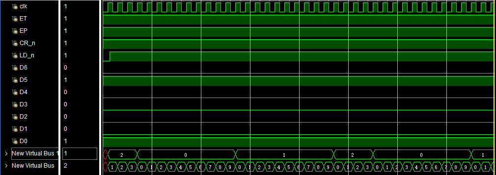

```verilog
module sim_module24_74160_P();
    reg clk,ET, EP, CR_n, LD_n;
    reg D6, D5, D4, D3, D2, D1, D0;
    wire Q6, Q5, Q4, Q3, Q2, Q1, Q0, rco;
    module24_74160_P u(clk,ET, EP, CR_n, LD_n, D6, D5, D4, D3, D2, D1, D0, Q6, Q5, Q4, Q3, Q2, Q1, Q0, rco);

initial
begin
    {D6, D5, D4} = 3'b010;//2
    {D3, D2, D1, D0} = 4'b0001;//1
    ET = 1'b1;
    EP = 1'b1;
    CR_n = 1'b1;
    clk = 1'b0;
    LD_n = 1'b0;
    fork
        {D6, D5, D4} = 3'b010;//2
        {D3, D2, D1, D0} = 4'b0001;//1
        forever #5 clk = ~clk;
        #7 LD_n = 1'b1;
    join
end
endmodule
```

### module60_74160_P

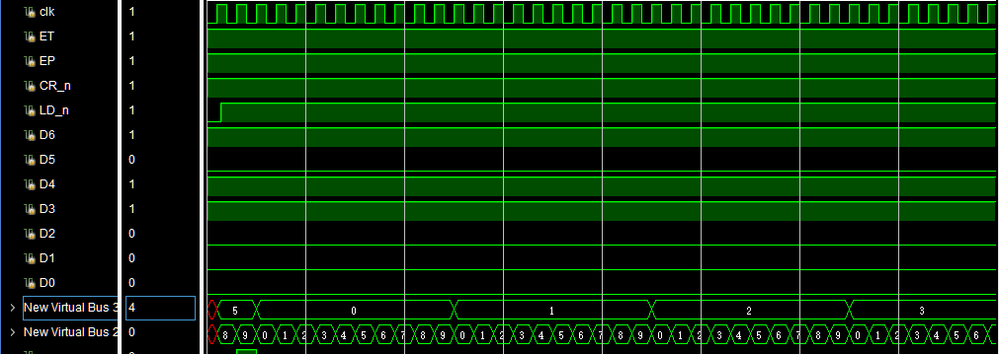

```verilog
module sim_module60_74160_P();
    reg clk,ET, EP, CR_n, LD_n;
    reg D6, D5, D4, D3, D2, D1, D0;
    wire Q6, Q5, Q4, Q3, Q2, Q1, Q0, rco;
    module60_74160_P u(clk,ET, EP, CR_n, LD_n, D6, D5, D4, D3, D2, D1, D0, Q6, Q5, Q4, Q3, Q2, Q1, Q0, rco);
    initial
    begin
        {D6, D5, D4} = 3'b101;//5
        {D3, D2, D1, D0} = 4'b0111;//7
        ET = 1'b1;
        EP = 1'b1;
        CR_n = 1'b1;
        clk = 1'b0;
        LD_n = 1'b0;
        fork
            {D6, D5, D4} = 3'b101;//5
            {D3, D2, D1, D0} = 4'b1000;//6
            forever #5 clk = ~clk;
            #7 LD_n = 1'b1;
        join
    end
endmodule
```

## Time_Display

### light_7seg

> 时钟显示为调用`Time_Basic`中产生的二进制时钟信号，转化为七段数码管可实现的信号，
>
> 因此仿真中不做展示。
>
> 主要操作为根据当前`led_flash_control`产生的使能信号，传递对应的时钟信号进行展示。

### led_flash_control

> 使用流水灯的原理进行展示
>
> 由于七段数码管及其使能信号均为低电平有效，因此在源文件中进行了电平翻转处理

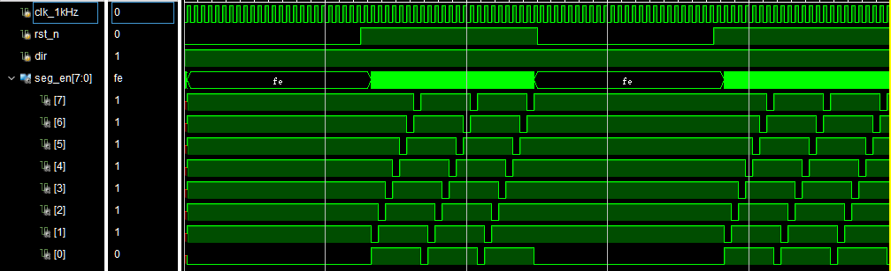

```verilog
module sim_led_flash_control();
    reg clk_1kHz, rst_n,dir;
    wire[7:0]seg_en;
    led_flash_control led_flash_control(clk_1kHz,rst_n,dir,seg_en );
    initial
    begin
        clk_1kHz = 1'b0;
        rst_n = 1'b0;
        dir = 1'b1;
        fork
            forever #5 clk_1kHz = ~clk_1kHz;
            forever #250 rst_n = ~rst_n;
        join
    end
endmodule
```

* * *

# CONSTRAINT FILE AND THE TESTING

* * *

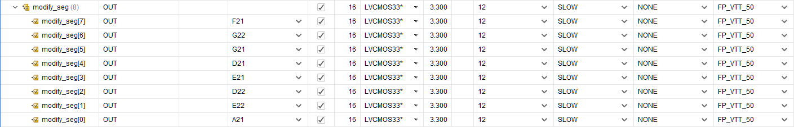

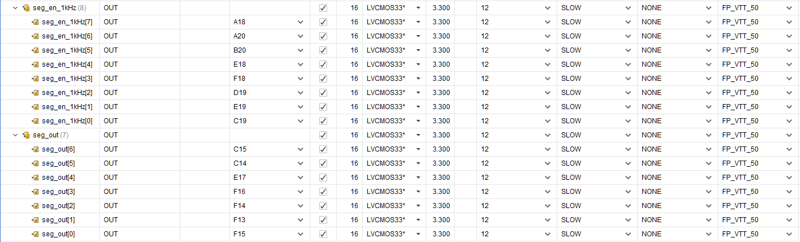

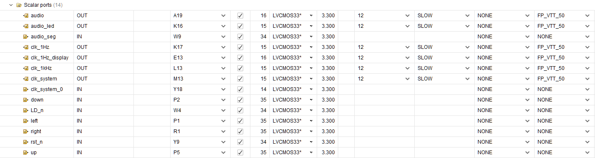

* * *

# THE DESCRIPTION OF OPERATION

* * *

*(write here)*

* * *

# Summary

* * *

## Task Allocations

### 11713020-张佳晨：

Led display, basic time and the standard clock

simulation and test the code on FPGA.


### 11712121-胡玉斌: 
make the buzzer part, the light flash

### 11712412-陈宇航: 
make the time modify part

## Problem & Solving

1. At the begining, we think that we should give the buzzer a frequency, but it didn't ring. Finally, we find that if we give the sign to make the buzzer ring 1000 times in a second, and it rings lightly! Also, we find the reference and know which tonality matchs the right frequency. Here is the tonality table:
```verilog
case(yinlu)
'd1:origin='d262;  //low
'd2:origin='d294;
'd3:origin='d330;
'd4:origin='d349;
'd5:origin='d392;
'd6:origin='d440;
'd7:origin='d494;
'd8:origin='d523;  //middle
'd9:origin='d587;
'd10:origin='d659;
'd11:origin='d698;
'd12:origin='d784;
'd13:origin='d880;
'd14:origin='d988;
'd15:origin='d1046;  //high
'd16:origin='d1175;
'd17:origin='d1318;
'd18:origin='d1397;
'd19:origin='d1568;
'd20:origin='d1760;
'd21:origin='d1967;
default:origin='d1024; // default
endcase     
```
Following the table, we can make every music as the alarm.

2. Once, we make a mistake that we match the parameters in wrong order, which make our alarm cann't work normally. And this mistake is not easy to check, so in the future, when we do a project, we should check the parameters in right order at the first time, name parameters in the right naming rule and write the comments to help others to understand the project codes in the fast speed.
3. The changing signal of hour is different than minute ,  while the changing signal of minute is only when the signal of second is at positive edge,  the changing signal of hour is at the time when signals of   second and minute are both at their positive edges.
